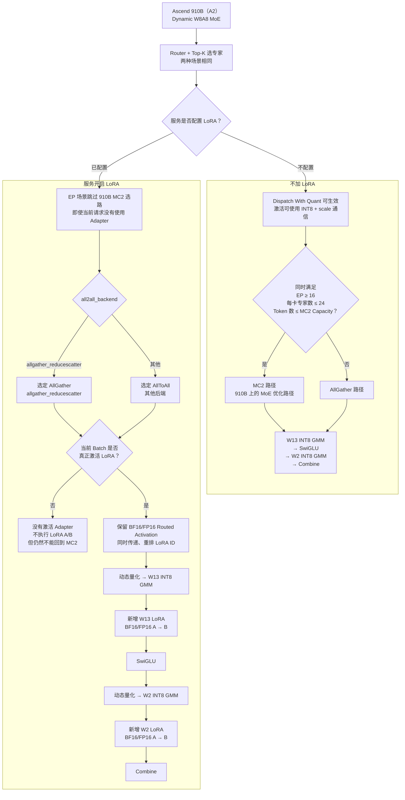

# Ascend 910B 上 W8A8 MoE 加载 LoRA 的推理性能差异

## 1. 结论摘要

在 Ascend 910B 上，W8A8 MoE 加载 LoRA 后，W13、W2 的主专家计算仍然使用 INT8 Grouped MatMul，并不会整体退化为 BF16/FP16。

性能差异主要来自以下两层开销：

1. **服务级开销：MoE 通信路径发生变化。** 在 Expert Parallel 场景中，只要服务配置了 LoRA，当前实现就不会选择 910B 的 MC2 路径，而是根据 `all2all_backend` 使用 AllGather 或 AllToAll。即使当前请求没有激活 Adapter，也可能承担这部分路径变化的代价。
2. **请求级开销：激活 Adapter 后增加浮点通信和低秩计算。** Routed Activation 需要保留为 BF16/FP16，同时传递 LoRA ID，并在 W13、W2 两个位置分别执行 LoRA A、B 投影。

因此，910B 上最大的性能差异通常不是 LoRA 参数本身，而是：

> 无 LoRA 时可以命中 MC2；配置 LoRA 后退回 AllGather/AllToAll；真正激活 Adapter 后，再增加 BF16/FP16 通信和 W13/W2 低秩计算。

## 2. 适用范围

本文讨论以下场景：

- 硬件：Ascend 910B，对应 vLLM Ascend 中的 A2 路径。
- 模型：Dynamic W8A8 MoE。
- 重点：Routed Experts 的 MoE LoRA 性能差异。
- 并行：重点分析启用 Expert Parallel 的部署。
- Shared Experts：采用普通 Dense LoRA 路径，应单独统计。

## 3. 910B 执行路径对比



## 4. 910B 上的通信路径修正

910B 属于 A2。当前 A2 自动选路不以 FusedMC2 作为主要路径，而是在满足条件时选择 MC2，否则选择 AllGather。

无 LoRA 且 Expert Parallel 生效时，选择 MC2 需要同时满足：

- EP World Size 不小于 16。
- 每个设备承载的专家数不大于 24。
- 当前 Token 数不超过 MC2 Token Capacity。

若任一条件不满足，则无 LoRA 基线使用 AllGather。

配置 LoRA 且 Expert Parallel 生效时：

- `--all2all-backend allgather_reducescatter`：选择 AllGather。
- 其他后端：选择 AllToAll。
- 不选择 MC2；MC2 和 FusedMC2 均不支持当前量化 MoE LoRA 注入。

## 5. MoE 部分的具体性能差异

### 5.1 通信路径变化

这是 910B 上最需要关注的差异。

如果无 LoRA 基线满足 MC2 条件，配置 LoRA 后将从 MC2 变为 AllGather 或 AllToAll，失去 MC2 的通信优化。该变化可能比 LoRA A/B 本身的计算开销更大。

需要特别注意：通信方法是根据服务中的 `lora_config` 选择的，而不是根据当前 Batch 是否真正激活 Adapter 选择的。因此，服务仅仅开启 LoRA，也可能使没有使用 Adapter 的请求无法命中 MC2。

### 5.2 Routed Activation 通信量增加

真正激活 LoRA 后，LoRA A 投影需要原始 BF16/FP16 输入，因此 Dispatch 侧不能像纯 W8A8 路径一样提前将 Routed Activation 保持为 INT8。

当无 LoRA 基线能够使用 INT8 Dispatch 时：

- INT8 主激活数据约为每元素 1 Byte。
- BF16/FP16 主激活数据约为每元素 2 Bytes。
- LoRA 路径还需额外传递并重排 Token-to-LoRA ID。

因此，主激活通信载荷大约可能增加到 2 倍；实际差异还取决于 Scale、LoRA ID、对齐、Padding 和 HCCL 通信效率。

### 5.3 W13 和 W2 的低秩计算

LoRA 在每个被选中的 Routed Expert 上增加两个注入点：

1. W13 基础 INT8 GMM 完成后、SwiGLU 之前，加入 W13 LoRA 增量。
2. W2 基础 INT8 GMM 完成后，加入 W2 LoRA 增量。

假设：

- `H` 为 Hidden Size。
- `I` 为单个 Expert Intermediate Size。
- `r` 为 LoRA Rank。
- `K` 为每个 Token 选择的专家数，即 Top-K。
- LoRA 同时作用于 W13 和 W2。

则每层、每个原始 Token 的 LoRA 理论增量约为：

```text
K × r × (2H + 3I) MAC
```

该公式只表示理论乘加量。实际耗时还会受到以下因素影响：

- BF16/FP16 计算吞吐。
- 小矩阵利用率。
- 算子启动次数。
- Expert 和 Adapter 权重 Gather。
- 多 LoRA 请求混合后的分组效率。

在 Decode 小 Batch 场景中，理论计算量虽然不大，但小 GMM 和算子启动开销可能比较明显。

### 5.4 LoRA ID 路由开销

MoE Token 会被 Top-K 扩展并按照 Expert 重排。启用 LoRA 后，Token 对应的 LoRA ID 必须执行相同的处理，包括：

- 按 Top-K Repeat/Expand。
- 按 Expert Permute。
- EP 场景下进行 AllToAll 或 AllGather。
- 通信完成后重新对齐 Expert 和 Adapter。

单独看 LoRA ID 的通信量通常不大，但相关的索引、排序、Gather 和小算子会增加延迟，尤其是在低并发 Decode 或 Multi-LoRA 混合 Batch 中。

### 5.5 MoE LoRA 的内存特点

MoE LoRA 的运行时计算量主要随 Top-K 增长，但 Routed Expert LoRA 权重库存随专家总数增长。

可以概括为：

```text
运行时计算量 ∝ Top-K × LoRA Rank
常驻 LoRA 权重 ∝ 专家总数 × LoRA 数 × LoRA Rank × 层数
```

因此，MoE 模型即使每个 Token 只激活少量专家，也可能因专家总数较多而占用较大的 LoRA 权重内存。

## 6. 不同部署场景下的预期影响

| 场景 | 主要差异 | 预期影响 |
| --- | --- | --- |
| 无 LoRA 基线满足 910B MC2 条件 | 配置 LoRA 后 MC2 变为 AllGather/AllToAll；激活 Adapter 后再增加浮点通信和 A/B 计算 | 通常最大 |
| 无 LoRA 基线本来就走 AllGather | 没有 MC2 路径损失，主要增加 BF16/FP16 通信、LoRA ID 和 A/B 计算 | 中等 |
| 服务开启 LoRA，但当前请求未激活 Adapter | 不执行 LoRA A/B；EP 下仍可能失去 MC2 | 取决于 MC2 是否原本可用 |
| 未启用 Expert Parallel 或 EP Group 为 1 | 两边均使用 AllGather，主要观察 LoRA 计算和 Dispatch 数据类型变化 | 通常较小 |
| 低并发 Decode | 小 GMM、权重 Gather、索引和算子启动占比提高 | 延迟更敏感 |
| 高并发或多节点 EP | BF16/FP16 通信量和通信后端差异占比提高 | 吞吐更敏感 |

以上为结构性判断，不代表固定的性能百分比。实际差异需要结合模型、卡数、TP/EP、Top-K、LoRA Rank、并发度和输入输出长度测量。

## 7. 建议的性能测试方法

为了把性能差异准确归因，建议测试三个配置：

1. **Baseline：** 服务不配置 LoRA。
2. **LoRA Engine Only：** 服务配置 LoRA，但请求不携带 Adapter。
3. **Active LoRA：** 服务配置 LoRA，请求实际激活 Adapter。

三个配置应保持以下条件一致：

- 相同模型和 W8A8 权重。
- 相同 TP、EP、DP 和卡数。
- 相同 ACL Graph/Eager 配置。
- 相同 Prompt Length、Output Length 和请求数据。
- 相同并发度和调度参数。
- 相同 warm-up 次数和统计窗口。

建议分别测试：

- Decode 小 Batch/低并发。
- Decode 中高并发。
- Prefill 短输入和长输入。
- 单节点与多节点 EP（如果生产环境涉及多节点）。

建议记录以下指标：

- TTFT。
- TPOT/ITL。
- Request Throughput。
- Output Tokens/s。
- NPU 利用率和 HBM 带宽。
- HCCL 通信耗时和通信数据量。
- MoE Dispatch、W13、W13 LoRA、W2、W2 LoRA、Combine 分阶段耗时。

其中：

```text
LoRA Engine Only - Baseline
```

主要体现服务开启 LoRA 后的通信选路变化；

```text
Active LoRA - LoRA Engine Only
```

主要体现浮点 Dispatch、LoRA ID 路由以及 W13/W2 LoRA 计算开销。

## 8. 配置注意事项

- 910B/A2 当前主要关注 MC2 与 AllGather/AllToAll 的差异，FusedMC2 不是 A2 自动选路的主要路径。
- 部署量化 MoE LoRA 时应保持 `VLLM_ASCEND_ENABLE_FUSED_MC2=0`。
- 如需 AllGather EP，应显式设置 `--all2all-backend allgather_reducescatter`。
- Dynamic EPLB 当前不支持量化 MoE LoRA。
- `--fully-sharded-loras` 不应与 `--enable-expert-parallel` 同时使用。
- TP-only 的 Fully Sharded LoRA 会额外引入 W13 AllGather 和 W2 AllReduce，需要单独评估其内存收益与通信开销。

## 9. 面向管理层的一句话总结

> 在 Ascend 910B 上，W8A8 MoE 加 LoRA 后，INT8 专家主干没有改变；性能损失首先来自 MC2 可能退化为 AllGather/AllToAll，其次才是 BF16/FP16 激活通信、LoRA ID 路由以及 W13/W2 两处低秩计算。

## 10. 实现依据

- [910B/A2 设备映射](../vllm_ascend/utils.py#L784)
- [A2 MC2 选择条件](../vllm_ascend/ascend_forward_context.py#L289)
- [LoRA EP 通信路径选择](../vllm_ascend/ascend_forward_context.py#L372)
- [W8A8 MoE LoRA 计算流程](../vllm_ascend/lora/quant_moe.py#L444)
- [AllToAll LoRA Dispatch 处理](../vllm_ascend/ops/fused_moe/token_dispatcher.py#L497)
- [LoRA 使用说明](source/user_guide/feature_guide/lora.md)
